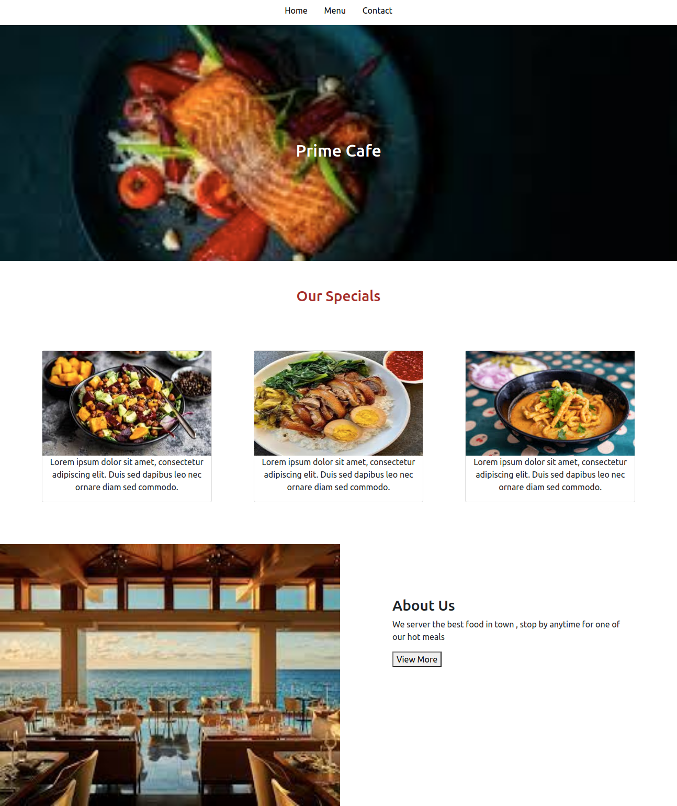

# Restaurant Page


In this project I built a very basic restaurant page using only JavaScript modules and webpack. All pages are generated using Javascript DOM manipulation and HTML Element creation.
## Built With

- JavaScript;
- Webpack;
- Bootstrap 4;
- Css

## Getting Started

```$ npm install --save-dev webpack```

To get a local copy of the repository please run the following commands on your terminal:

```
$ cd <folder>
```

```
$ git clone https://github.com/Stephanie041996/Restaurant.git
```

```
$ cd restaurant-page
```

```
$ point your browser to 'dist/index.html'
```

## AUTHOR

**Stephanie Sakuhuni**
- GitHub: [@stephanie041996](https://github.com/Stephanie041996)
- LinkedIn: [@Stephanie Sakuhuni](https://www.linkedin.com/in/stephanie-michelle-sakuhuni/) 


## Show your support

Give a ⭐️ if you like this project!

## Acknowledgments

- Hat tip to anyone whose code was used.
- Inspiration
- etc
